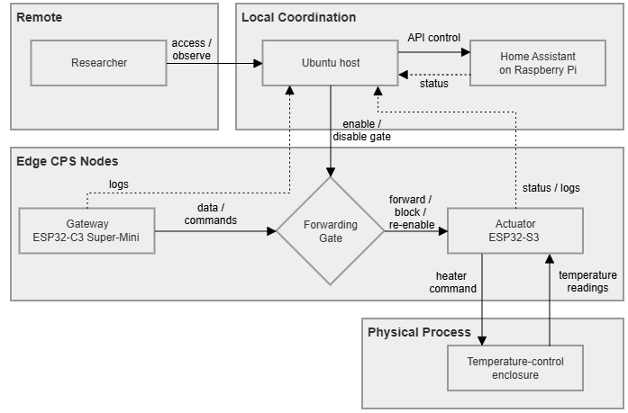

# Architecture

The current pilot uses a small CPS-aligned testbed to observe what happens when forwarding from a gateway to an actuator is interrupted and later restored.

The architecture is intentionally kept small so that the evidence remains clear and reproducible.

Solid arrows show control, data, or physical interaction.  
Dashed arrows show status, logs, or observation paths.

## Components

### Ubuntu host

The Ubuntu host runs the pilot script. It controls the experiment phases, calls the Home Assistant API, starts evidence collection, and archives run outputs.

### Raspberry Pi with Home Assistant

The Raspberry Pi runs Home Assistant. In this pilot, Home Assistant provides the API used by the host script to control the gateway-side forwarding gate.

### ESP32 gateway

The ESP32 gateway exposes the forwarding gate. The pilot uses this gate to create a controlled forwarding interruption and re-enable the path afterwards.

### ESP32-S3 actuator node

The ESP32-S3 actuator node is placed on the enclosure side. It is the main observation point because local fallback and recovery-related cues are checked from actuator-side observations.

### Physical process

The physical process is represented by the temperature-control enclosure. In the current public pilot, the enclosure is included as context, while the main evidence is limited to forwarding-gate control and selected observation.

## Control flow

The host script coordinates the run through Home Assistant:

1. Enable forwarding for baseline.
2. Disable forwarding for cutoff.
3. Re-enable forwarding for recovery observation.
4. Archive selected evidence.

## Observation flow

The main observation is made on the actuator side.

The pilot checks whether actuator-side fallback and recovery-related cues can be followed when the forwarding path changes.

## Boundary

This architecture is used for a minimum pilot. It is not a middleware framework, a security design, or a comparison system for recovery methods.

The current claim is limited to host-controlled forwarding interruption and selected observation.
